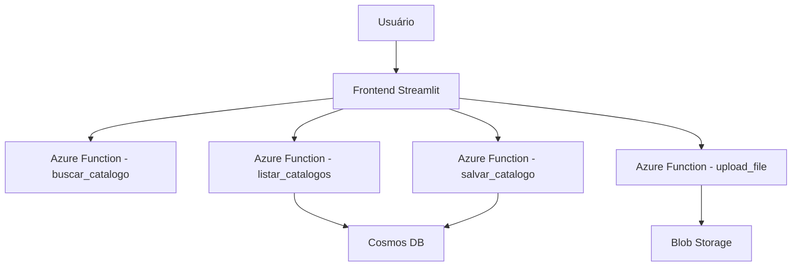

# Gerenciador Netflix - Documentação Técnica

## Sumário
- [Introdução](#introducao)
- [Arquitetura](#arquitetura)
- [Setup do Ambiente](#setup-do-ambiente)
- [Custo Estimado](#custo-estimado)
- [Fluxo de Uso](#fluxo-de-uso)
- [Troubleshooting](#troubleshooting)
- [Referências](#referencias)

---
## Introdução
Projeto para gerenciamento de catálogo Netflix na nuvem Azure, com frontend em Streamlit, funções serverless e infraestrutura como código em Terraform.

## Arquitetura
| Componente        | Descrição                                      |
|-------------------|:----------------------------------------------|
| Azure Functions   | Processa recebimento, listagem e busca de dados|
| Cosmos DB         | Banco de dados NoSQL para armazenamento seguro |
| Blob Storage      | Guarda catálogos e arquivos do sistema         |
| Streamlit Frontend| Interface de uso intuitiva para interação      |
| Terraform         | Orquestra provisionamento automático de recursos|



## Setup do Ambiente
1. **Pré-requisitos**
   - Conta Azure
   - Azure CLI instalado
   - Python 3.8+
   - Terraform instalado
2. **Infraestrutura**
   ```bash
   cd infra
   terraform init
   terraform apply
   ```
3. **Funções Serverless**
   ```bash
   cd functions
   func azure functionapp publish <NOME_DA_FUNCTION_APP>
   ```
4. **Frontend**
   ```bash
   cd frontend
   pip install -r requirements.txt
   streamlit run app.py
   ```
5. **Scripts auxiliares**
   Para popular dados:
   ```bash
   cd scripts
   python populate.py
   ```

## Custo Estimado
| Serviço        | Tipo            | Estimativa Mensal (USD)* |
|----------------|-----------------|--------------------------|
| Azure Functions| Consumo/Grátis  | $0 - $10                 |
| Cosmos DB      | Serverless      | $5 - $25                 |
| Blob Storage   | Hot/GB          | $1/50GB                  |
| Streamlit      | Local/Grátis    | $0                       |
| *valores podem variar de acordo com uso e região |

## Fluxo de Uso
1. Usuário acessa a interface Streamlit
2. Realiza upload/salva catálogo via frontend
3. Função Azure processa requisição, salva dados
4. Cosmos DB armazena informações do catálogo
5. Listagem e busca ficam disponíveis no frontend

## Troubleshooting
| Situação                       | Solução                                        |
|-------------------------------|------------------------------------------------|
| Erro ao subir função           | Verifique credenciais Azure e permissões        |
| Dados não aparecem no frontend | Confirme endpoint e variáveis de ambiente       |
| Falha no Terraform             | Rode `terraform plan` para analisar conflitos   |

## Referências
- [Azure Functions](https://docs.microsoft.com/azure/azure-functions/)
- [Cosmos DB](https://docs.microsoft.com/azure/cosmos-db/)
- [Streamlit](https://docs.streamlit.io/)
- [Terraform](https://registry.terraform.io/)
- [Documentação oficial Azure](https://docs.microsoft.com/azure/)
